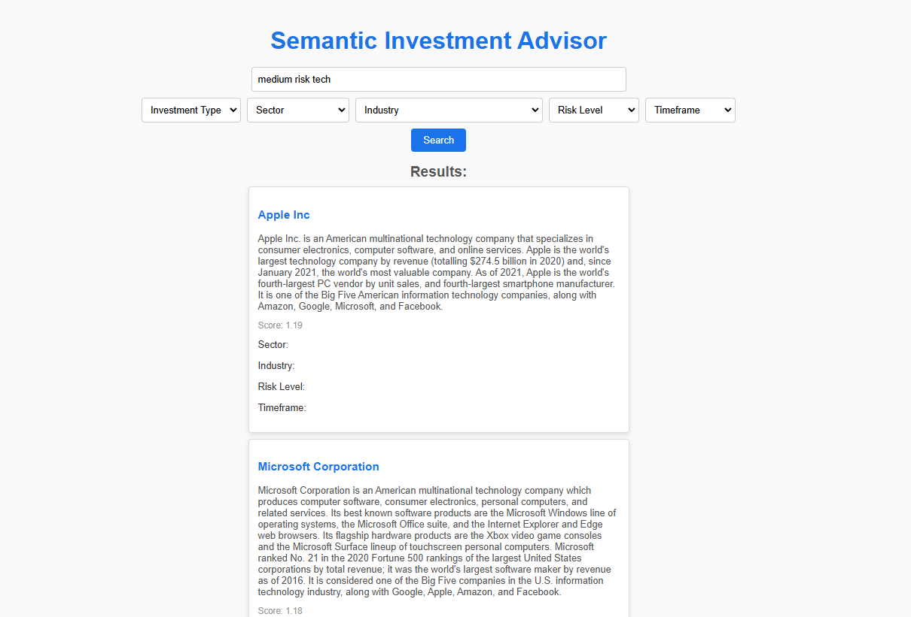

# FinanceAdvisorElastic
# Finance Advisor Search Service

A semantic search application powered by Flask and Elasticsearch that helps users find investment data using natural language queries. This service enables filtering results by criteria like risk level, timeframe, and sector, making it easy to find relevant investment options.

---

## Features

- **Semantic Search**: Uses pre-trained Sentence Transformers (`all-MiniLM-L6-v2`) for natural language understanding.
- **Custom Filters**: Supports filtering by attributes like `risk_level`, `timeframe`, and `sector`.
- **Elasticsearch Integration**: Stores and indexes investment data for fast and scalable searches.
- **REST API**: Provides a simple and intuitive interface for search queries.

---

## Project Structure

---

## Prerequisites

- **Python 3.7+**
- **Elasticsearch** (7.x or 8.x)
- **Node.js** (optional, for frontend integration)

